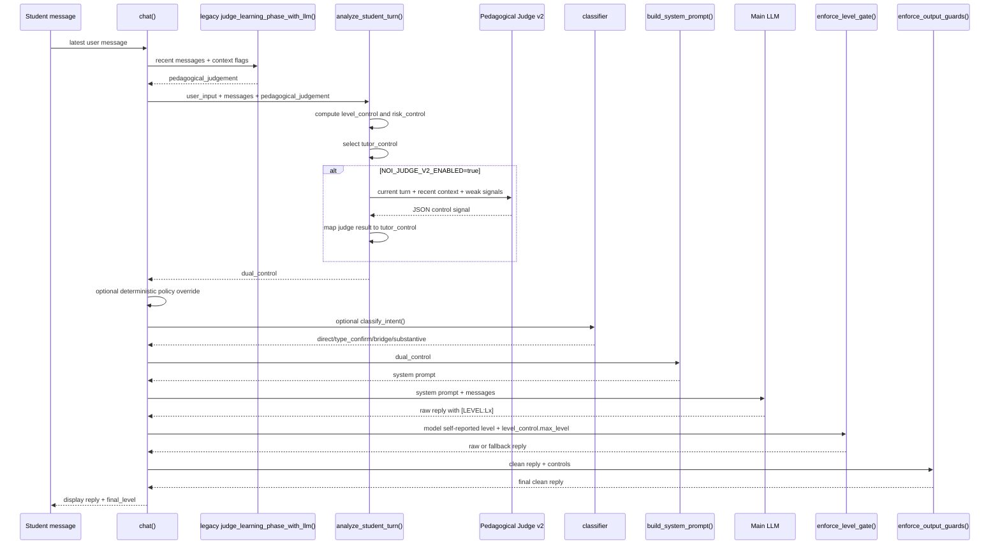

# AIChat Current Flow v1

Status: code-grounded snapshot for research planning.
Scope: this document describes the current AIChat runtime in `noi_agent.py`; it does not describe planned Bridge Judge behavior.

## Entry Point

`chat(messages, student_id, problem_id, chat_model_provider=None)` in `noi_agent.py` is the student-visible AIChat entry point.

It returns:

```text
(reply_for_display, reply_for_history, final_level)
```

## Current Runtime Sequence



## Function-Level Facts

| Step | Function | Calls LLM | Writes DB | Student-visible effect |
| --- | --- | --- | --- | --- |
| Extract latest message | `chat()` | no | no | chooses current user turn |
| Learning phase rubric | `judge_learning_phase_with_llm()` | yes | no | feeds `pedagogical_judgement` into control selection |
| Rule analysis | `analyze_student_turn()` | optionally | no | creates `level_control`, `risk_control`, `tutor_control` |
| Optional Judge v2 | `_apply_judge_v2_override()` -> `pedagogical_judge_v2()` | yes | no | can replace `tutor_control` only |
| Policy override | `build_policy_override_reply()` | no | no | may bypass main LLM with deterministic reply |
| Classifier | `classify_intent()` via `chat()` | yes | no | currently appends risk tags in `risk_control` |
| Prompt build | `build_system_prompt()` | no | no | injects control instructions into main LLM prompt |
| Main tutor generation | `_chat_completion_create()` | yes | no | generates student-facing reply |
| Hard gate | `enforce_level_gate()` | no | no | blocks replies whose self-reported `[LEVEL]` exceeds `level_control.max_level` |
| Output guard | `enforce_output_guards()` | no | no | only catches fill-blank answer code and unstable ASCII diagrams |

## Current Control Precedence

1. Rule analysis computes `level_control.max_level`.
2. `Pedagogical Judge v2`, when enabled and successful, maps its result into `tutor_control`.
3. Current Judge v2 mapping does not update `level_control.max_level`.
4. The hard gate uses `level_control.max_level`, not `tutor_control.judge_allowed_help_level`.
5. The optional classifier path in `chat()` appends risk tags, but does not call `merge_intent_with_control()` and therefore does not currently lower `level_control.max_level`.
6. `enforce_level_gate()` trusts the model's self-reported `[LEVEL:Lx]` tag. It does not independently inspect semantic leakage.
7. `enforce_output_guards()` is not a general leakage judge. It only blocks two high-confidence hazards:
   - fill-blank near-complete answer code;
   - unstable ASCII diagrams.

## Research Implication

The current system is best described as:

```text
rules + legacy pedagogical phase judge + optional Pedagogical Judge v2
+ prompt-level scaffold control + self-reported-level hard gate
+ narrow output safety guards
```

It should not yet be described as:

```text
turn-level missing bridge diagnosis + bridge-aware scaffold controller
+ independent critical bridge leakage judge
```

To make the latter claim, the runtime needs explicit bridge fields, coach-label evaluation, and a content-level leakage judge.
