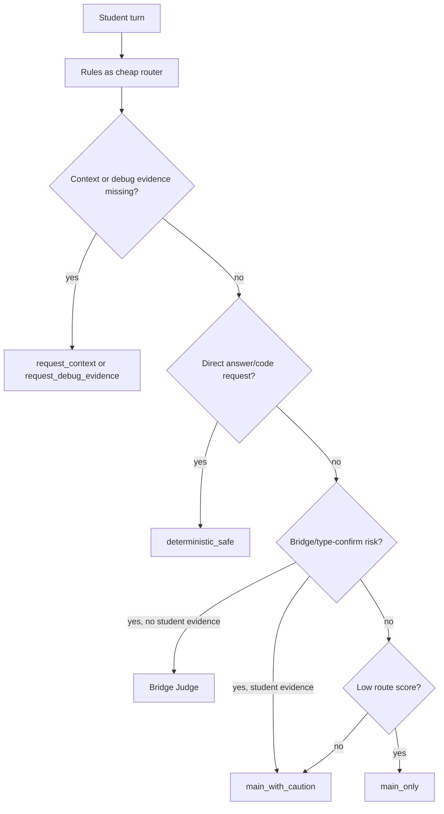
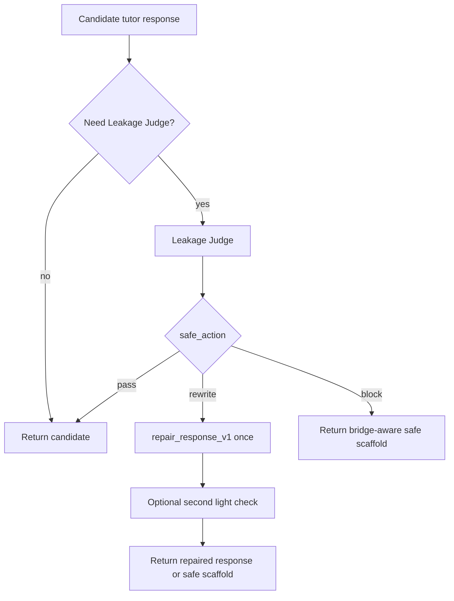

# AIChat Risk Routing Policy v1

Status: proposed runtime policy. This document does not describe behavior currently wired into `chat()`.

## Purpose

Risk-triggered bridge-aware routing should balance three goals:

1. keep low-risk AIChat turns fast;
2. call Bridge Judge only when semantic diagnosis is useful;
3. call Leakage Judge only when the candidate reply may reveal the missing bridge.

Rules are cheap routing signals, not gold labels. Bridge Judge performs semantic turn-level diagnosis. Leakage Judge performs post-generation content-level leakage detection.

## Three Risk Variables

Do not collapse every risk into one `risk_level`.

| Variable | Timing | Meaning | Main source |
| --- | --- | --- | --- |
| `input_route_risk` | Before generation | How carefully this student input should be routed. | Rules plus context. |
| `diagnosis_uncertainty` | Before generation | Whether there is enough evidence to diagnose the student's missing bridge. | Context completeness, code/debug evidence, student attempt. |
| `output_leakage_risk` | After generation | Whether the candidate reply reveals the critical bridge or answer. | Candidate reply plus Bridge Judge contract. |

Example:

- `missing_context` usually means `diagnosis_uncertainty=high`, not necessarily `output_leakage_risk=high`.
- `direct_request` usually means `input_route_risk=high` and can use deterministic safe scaffold without calling every judge.
- A low-risk student question can still produce a high-risk candidate response if the main LLM over-explains.

## Pre-Generation Routing



### Route Table

| Route | Trigger | Online action | Notes |
| --- | --- | --- | --- |
| `main_only` | Low `input_route_risk`, low `diagnosis_uncertainty`. | Rules -> main LLM. | Record trace, but skip expensive judges. |
| `main_with_caution` | Some risk, but student has useful evidence or already stated the bridge. | Rules -> stricter prompt -> main LLM. | Useful for evidence-backed type confirmation. |
| `bridge_judge` | Medium/high semantic risk, especially bridge attempt or unsupported type confirmation. | Rules -> Bridge Judge -> main LLM. | Bridge Judge output becomes a contract, not a student reply. |
| `deterministic_safe` | Direct answer, full code, full solution, or obvious executive help request. | Rules -> safe scaffold. | Do not waste calls on a predictable unsafe request. |
| `request_context` | Missing problem context. | Ask for题面、题号、目标或样例. | Treat as high diagnosis uncertainty. |
| `request_debug_evidence` | Debugging request lacks code, failing case, expected output, or suspicion target. | Ask for minimal debug evidence. | Not automatically leakage high. |
| `bridge_then_leakage_required` | High semantic risk and a candidate reply is needed. | Bridge Judge -> main LLM -> Leakage Judge. | For hard cases where deterministic safe scaffold is too blunt. |

## Suggested Pre-Generation Rules

Use `compute_pre_generation_route_risk()` as a pure policy helper before wiring anything into `chat()`.

Input fields:

```json
{
  "rule_risk_tags": ["bridge_attempt"],
  "has_problem_context": true,
  "has_code": false,
  "has_debug_target": false,
  "has_substantive_attempt": false,
  "student_already_stated_bridge": false,
  "latest_user_message": "我知道要 DP，但状态怎么定义？"
}
```

Output fields:

```json
{
  "input_route_risk": "medium",
  "diagnosis_uncertainty": "medium",
  "recommended_route": "bridge_judge",
  "reasons": ["bridge_attempt"],
  "route_score": 2
}
```

Route score is only a runtime policy signal. It is not a research gold label.

## Bridge Judge Confidence Policy

When Bridge Judge exists in online or shadow mode:

| Confidence | Policy |
| --- | --- |
| `>= 0.85` | May act as primary semantic control signal. |
| `0.65-0.85` | Use as soft instruction; do not change hard gate by itself. |
| `< 0.65` | Do not take control; prefer clarification or evidence request. |

This avoids repeating the current Pedagogical Judge v2 issue where low-confidence output can still override `tutor_control`.

## Post-Generation Leakage Trigger

Leakage Judge should inspect candidate replies only when useful.

Trigger Leakage Judge if any condition holds:

- Bridge Judge `leakage_risk=high`.
- `input_route_risk=high` and the route generated a candidate reply.
- Student directly requested answer/code/method and a candidate reply was generated.
- Candidate response contains a complete code block.
- Candidate response states a complete DP state definition that the student did not already state.
- Candidate response states a complete transition equation.
- Candidate response states a complete `check` condition or boundary-update rule.
- Candidate response gives a full greedy criterion, proof, or numbered full algorithm.
- Candidate response names the algorithm as a final confirmation when the student only asked for type confirmation.

Do not treat every formula or algorithm word as leakage. Leakage depends on whether the student already stated that bridge and whether the candidate reply fills the missing bridge.

## Post-Generation Flow



## Timeout And Fallback Policy

| Component | Timeout result |
| --- | --- |
| Bridge Judge timeout | Fall back to current rules and record timeout. |
| Bridge Judge timeout with high uncertainty | Ask for context/evidence rather than guessing. |
| Leakage Judge timeout on low/medium risk | Return candidate and record uncertainty in shadow logs. |
| Leakage Judge timeout on high risk | Do not return candidate; return bridge-aware safe scaffold. |
| Repair timeout | Return bridge-aware safe scaffold. |

## What Is Not Implemented Yet

Currently implemented:

- Current AIChat rules and prompt-level control.
- Offline `bridge_judge_v1()`.
- Pure `compute_pre_generation_route_risk()` helper.

Not implemented yet:

- Runtime wiring of `compute_pre_generation_route_risk()` into `chat()`.
- Leakage Judge.
- Repair loop.
- Shadow mode logging for route decisions.
- Active-mode Bridge Judge routing.

## Research Framing

This policy supports a research claim around risk-triggered bridge-aware routing:

```text
Cheap rules route obvious low-risk or deterministic cases, while Bridge Judge and Leakage Judge are invoked only when semantic diagnosis or content-level leakage detection is needed.
```

Evaluation should compare:

- current system;
- full judge every turn;
- risk-triggered judge routing;
- bridge judge plus leakage judge;
- bridge judge plus leakage judge plus repair.

Key metrics:

- critical bridge leakage rate;
- coach preference;
- average latency;
- LLM calls per turn;
- false-positive rewrite rate;
- next-turn progress.
