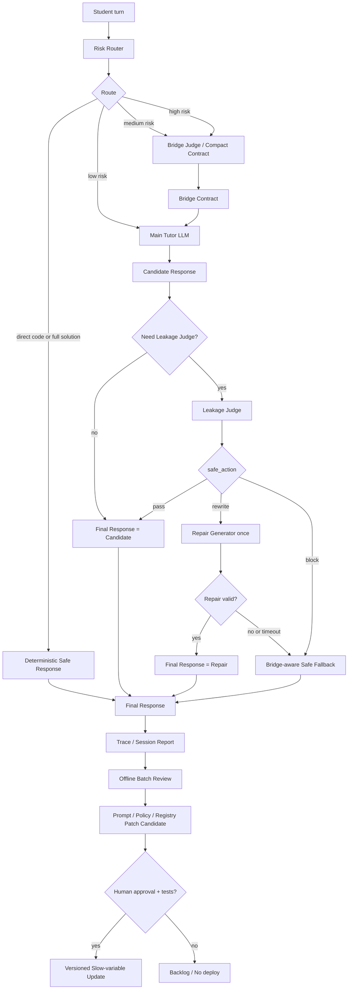

# Control Harness Policy v1

Status: research design policy. This document does not wire new behavior into online `chat()`.

## Purpose

This policy keeps Research v1 from drifting into an unbounded multi-agent system. The project may use a feedback-control-inspired harness as a system organization principle, but the paper's main innovation remains:

1. CP-specific missing bridge schema;
2. critical bridge leakage definition and evaluation;
3. coach expert-reference turn-level data;
4. Bridge Contract Tutor, Leakage Judge, and Repair ablations;
5. risk-triggered routing trade-offs among response quality, leakage, and latency.

Do not make "engineering cybernetics" or control theory the main paper claim.

Research reports should be kept in bilingual pairs. Hand-written smoke reports
use `*.md` for English and `*.zh.md` for Chinese. Auto-generated offline
summaries must also emit both English and Chinese Markdown so coach-facing
review can use the Chinese report while external review can use the English
report.

## Scope Lock

### Research v1 Includes

- Coach-facing v2 annotation schema and reliability protocol.
- Compact runtime bridge contract.
- Offline Bridge Judge diagnosis.
- Offline Bridge Contract Tutor.
- Offline Leakage Judge.
- Offline Repair Generator.
- Risk-triggered routing simulation.
- Response blind review workbook and summary metrics.
- Latency and LLM-call accounting.

### Research v1 Excludes

- Full multi-judge execution on every online student turn.
- Automatic system prompt rewriting during a chat.
- Automatic weekly prompt deployment without human approval.
- Long-term student model or memory layer.
- Full NOI algorithm ontology coverage.
- Treating single-coach labels as absolute truth.
- Treating control theory itself as the paper's primary novelty.

## Three Timescales

### Slow Variables

Slow variables are system rules. They must not be changed inside a student conversation.

Examples:

- system prompt;
- policy prompt;
- Bridge Judge prompt;
- Leakage Judge prompt;
- Repair prompt;
- rubric;
- bridge schema;
- focus registry;
- algorithm topic registry;
- risk routing policy;
- deterministic fallback policy.

Slow variables may change only after offline review, regression tests, and human approval.

### Mid-Timescale Variables

Mid-timescale variables are per-turn control contracts. They change every turn but do not rewrite global rules.

The main object is the bridge contract:

```json
{
  "student_state_summary": "学生知道要 LCA，但不知道路径贡献如何落到端点和 LCA 附近标记。",
  "missing_bridge_summary": "缺少把单条路径贡献压缩成端点/LCA 标记并 DFS 汇总的桥。",
  "allowed_help_level": "L2",
  "help_forms": ["micro_example", "guiding_question"],
  "must_not_reveal": ["完整端点/LCA 加减公式", "完整树上差分代码"],
  "leakage_risk": "high",
  "next_student_action": "让学生先用一条 3-4 个点的小路径判断哪些节点的贡献应该发生变化。"
}
```

The bridge contract guides the tutor response for this turn only.

### Fast Variables

Fast variables exist within one turn:

- `candidate_response`;
- `leakage_judge_result`;
- `repair_response`;
- `final_response`;
- `final_response_source`;
- `stage_latency_ms`.

Repair operates on fast variables only. It rewrites the current candidate reply; it does not patch prompts, rubrics, registries, or policies.

## Online Rule

During a student chat:

```text
Repair may revise the current final_response.
Repair must not revise system prompts or global policy.
```

In short:

```text
课堂内只修回答，不修法律。
```

## Prompt Patch Rule

Prompt patching is a slow-variable update. It can happen only after all of the following are true:

1. Multiple cases show the same recurring failure pattern.
2. The failure is supported by logs, coach review, or response blind review.
3. A minimal regression case is added.
4. The proposed patch changes one layer only.
5. Smoke tests pass after the patch.
6. A human approves the change.

Patch one rule at a time. Do not bundle prompt, rubric, registry, and router changes unless the experiment explicitly requires a combined ablation.

## Control Goals

The harness optimizes process-level tutoring signals, not long-term contest ability by itself.

Primary goals:

- reduce critical bridge leakage;
- improve scaffold appropriateness;
- preserve or improve next-turn progress;
- keep p50 and p95 latency within a usable range;
- limit LLM calls per turn;
- reduce false-positive rewrites and unnecessary blocks.

## System Mapping

| Control-harness role | Project component |
| --- | --- |
| Control goals | leakage rate, scaffold appropriateness, next-turn progress, latency, call count |
| State estimator | Bridge Judge or compact bridge contract |
| Controlled generator | Main Tutor LLM |
| Output sensor | Leakage Judge, coach response review, next-turn learning evidence |
| Controller | Risk Router / Scaffold Controller |
| Actuators | bridge contract, allowed help level, help forms, forbidden content, deterministic fallback |
| Fast correction | Repair Generator |
| Slow feedback update | prompt patch, focus registry update, routing policy update, regression tests |

## Online Routing Principle

The online strategy is not "more judges every turn." It is "minimum necessary control."

| Route | Trigger | Action |
| --- | --- | --- |
| Low risk | clear context, no bridge leakage risk | Main LLM only. |
| Medium risk | missing bridge likely, but not a direct answer request | Bridge Judge -> Main LLM. |
| High risk | critical bridge request or high leakage risk | Bridge Judge -> Main LLM -> Leakage Judge. |
| Direct full solution/code request | obvious complete answer or complete code request | Deterministic safe response. |
| Leakage rewrite | Leakage Judge returns `rewrite` | Repair once, then return repaired response or fallback. |
| Leakage block or timeout | severe leak, repair timeout, or high-risk judge timeout | Bridge-aware safe fallback. |

This policy aligns with [aichat_risk_routing_policy_v1.md](aichat_risk_routing_policy_v1.md).

## Repair Policy

Repair is a generator, not a judge.

Correct naming:

```text
Leakage Judge = detects violation.
Repair Generator = rewrites the candidate response.
```

Repair input:

- original candidate response;
- leakage judge violation report;
- bridge contract;
- recent dialogue;
- student message.

Repair output:

- a natural student-visible reply;
- no mention of "leakage detection", "audit failure", or internal policy;
- no leaked elements listed by the Leakage Judge;
- same or weaker allowed help level;
- same or safer help forms.

Repair limit:

```text
At most one repair attempt per turn.
```

If repair fails, times out, or still leaks, return a deterministic bridge-aware safe scaffold.

## Offline, Shadow, Active

### Offline Mode

Purpose:

- compare baselines;
- estimate quality/leakage/latency trade-offs;
- calibrate prompts and routing policies.

Allowed:

- full multi-judge every turn;
- oracle guard ablation;
- repeated repair experiments;
- coach blind review.

Not allowed:

- treating offline behavior as already deployed online.

### Shadow Mode

Purpose:

- run Bridge Judge and Leakage Judge in the background;
- record `would_rewrite`, `would_block`, latency, and false-positive candidates;
- avoid changing student-visible replies.

Promotion criteria:

- low false-positive rewrite rate;
- acceptable p95 latency;
- coach review accepts most intervention decisions;
- no privacy or logging issues.

### Active Mode

Purpose:

- affect student-visible replies only after offline and shadow evidence.

Initial active mode should be risk-triggered, not full multi-judge every turn.

Promotion criteria:

- offline benchmark improves leakage and response quality;
- shadow mode shows acceptable intervention precision;
- fallback quality is acceptable;
- online p95 latency budget is met;
- regression tests cover known failure modes.

## Mermaid Flow



## Metrics

Report at least:

- bridge family agreement with expert reference labels;
- registered focus agreement;
- scaffold level agreement;
- response blind-review quality score;
- critical bridge leakage rate;
- answer/code leakage rate;
- repair rate;
- repair success rate;
- repair still-leaks rate;
- false-positive rewrite rate;
- p50 and p95 latency;
- LLM calls per turn;
- token or cost estimate when available.

## Research Wording

Use:

```text
feedback-control-inspired tutoring harness
risk-triggered control harness
minimum necessary control
slow/mid/fast timescale separation
```

Avoid:

```text
new cybernetic theory of tutoring
automatic prompt self-repair during chat
full multi-judge online control by default
```

## Next Experiments

Run the smallest useful ablation before expanding the system:

1. `current_system`
2. `single_llm_structured`
3. `bridge_contract`
4. `bridge_contract_plus_guard`
5. `bridge_contract_plus_guard_plus_repair`
6. `risk_triggered_simulation`

Use `final_response_text` for blind review. Do not ask coaches to rate internal candidate responses unless the experiment is specifically about repair analysis.
