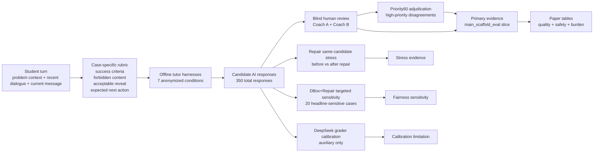
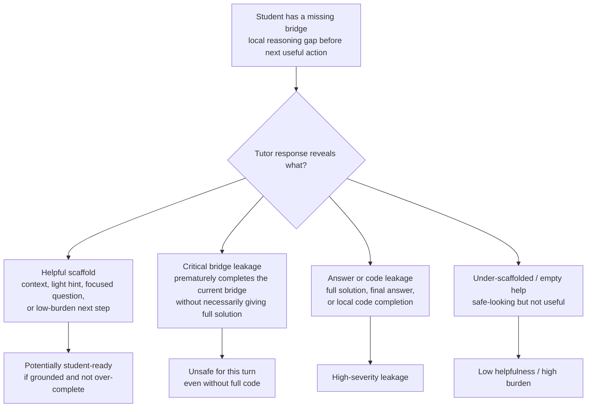
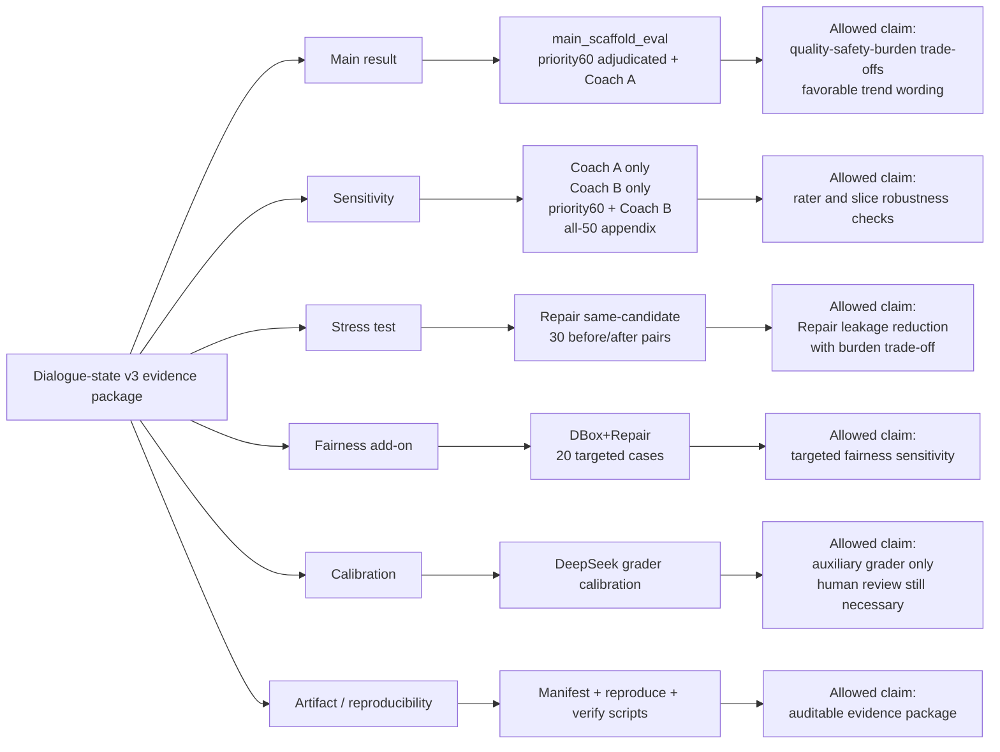

# Paper Figure Source: Dialogue-State v3 20260518

## 使用边界

本文档提供 dialogue-state v3 manuscript figures 的可编辑 Mermaid source。它不新增实验、不修改数据、不接入线上 active mode。这些图只是 claim-boundary aids，不是新证据。

请和以下文件一起使用：

- `paper_figure_table_plan_dialogue_state_v3_20260518.zh.md`
- `paper_submission_manuscript_dialogue_state_v3_20260518.zh.md`
- `paper_appendix_skeleton_dialogue_state_v3_20260518.zh.md`
- `dialogue_state_v3_paper_claims_final_gate_20260518.zh.md`

## Figure 1. CP-MissingBridgeBench Evaluation Flow

目的：展示从学生轮次到 case-specific rubric、offline tutor harness responses、blind human review 和 evidence classes 的路径。



Caption draft:

```text
CP-MissingBridgeBench evaluates turn-level tutoring responses with case-specific rubrics and blind human review. The main headline comes from the main_scaffold_eval slice; Repair, DBox+Repair, and LLM-grader results are separate stress, sensitivity, and calibration evidence.
```

不能暗示：

- online active-mode deployment；
- Guard-only final-response rewrite；
- all-50 aggregate headline；
- LLM grader replacement for human review。

## Figure 2. Critical Bridge Leakage Boundary

目的：解释 critical bridge leakage 如何不同于 final answer/code leakage，也不同于 helpful scaffolding。



Caption draft:

```text
Critical bridge leakage is a turn-level pedagogical failure: a response may avoid final code or a full solution while still completing the key intermediate reasoning the student should derive. Case-specific rubrics define the boundary between helpful scaffold, acceptable reveal, critical bridge leakage, and answer/code leakage.
```

不能暗示：

- 所有有信息量解释都是 leakage；
- 任何 hint 都不安全；
- 不看 case-specific rubric 也能判断边界。

## Figure 3. Evidence Classes and Claim Boundaries

目的：帮助 reviewer 区分 main results、sensitivity、stress、fairness、calibration 和 artifact evidence。



Caption draft:

```text
The paper separates evidence classes to prevent overclaiming. Only the main_scaffold_eval view is used for the headline result. Repair causality comes from same-candidate stress testing, DBox+Repair is targeted fairness sensitivity, and DeepSeek grader calibration is auxiliary rather than a human-review replacement.
```

不能暗示：

- stress tests 是 main experiment conditions；
- DBox+Repair 是 full 50-case double-coach condition；
- LLM grader outputs 是 gold labels；
- sensitivity views 会改变 headline slice。

## Production Notes

- 最终渲染版中尽量缩短 figure labels。
- 图注或表注必须写明 evidence class boundaries。
- 如果篇幅紧，正文只保留 Figure 1，将 Figure 2 / Figure 3 放入 appendix。
- 如果合并 Figure 2 和 Figure 3，必须保留两个核心意思：critical bridge leakage boundary 和 evidence-class boundary。
- 不要用这些图引入 evidence manifest 中不存在的新 claim。
