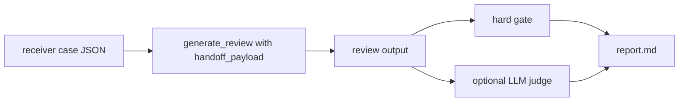

# Checkin Handoff Receiver Quality Gate Design

Date: 2026-04-16

## Summary

This design adds a narrow receiver-side quality gate for the AIChat to checkin handoff contract.

The April 15 handoff contract already verifies that AIChat can route high-risk moments into checkin review and that the frontend can carry the handoff payload. This design verifies the next step: when checkin review receives that payload, the generated review must behave like `checkin_reflection`, not like ordinary AIChat and not like a full solution generator.

The v0 gate is intentionally small. It covers only:

- `ac_unclear_in_aichat`
- `repeated_stuck_exit`

It does not add knowledge markers, mastery tracking, HINA, DIF, teacher dashboards, or a full code-understanding quiz system.

## Problem

Current validation proves that:

- AIChat emits a deterministic handoff payload.
- Vue stores and submits the payload.
- `review_engine` prompt construction can see `source=checkin_reflection`.

It does not prove that real generated checkin reviews:

- Ask an understanding-verification point after AC-but-unclear handoff.
- Split one stuck bridge after repeated-stuck handoff.
- Use the extra checkin permission for small examples without leaking a full solution.
- Preserve the red lines around complete code, complete formulas, complete DP state, complete `check(mid)`, and A/B answer leakage.

This design adds an eval gate to answer one question:

> Did checkin review actually catch the student after AIChat handed them off?

## Non-Goals

v0 does not include:

- Any new student UI.
- Any new teacher UI.
- A new AIChat policy.
- Full code-understanding verification templates.
- Knowledge marker fields.
- Mastery status updates.
- Conversation analytics.
- Frontend/browser e2e coverage.

Frontend and payload transport were already covered by the handoff contract work. This gate focuses on generated checkin review content.

## Scope

### Covered Risk Types

#### `ac_unclear_in_aichat`

The student says they have AC / passed / accepted, but also says they are unsure, guessed, confused, or want to understand why.

Expected receiver behavior:

- Use review language, not live AIChat tutoring language.
- Treat the problem as a reflection record.
- Ask one understanding-verification point.
- Tie the verification point to the problem, the student's stated uncertainty, or a local line of existing code.
- Avoid reteaching the complete solution.
- Avoid confirming that the student's whole approach is correct.

#### `repeated_stuck_exit`

The student has repeatedly failed to progress in AIChat, and AIChat exits to checkin review.

Expected receiver behavior:

- Record or restate the specific stuck point.
- Use one small example, 3-5 nodes, or a tiny input to split one bridge.
- Keep the review focused on one bridge.
- Avoid A/B options where one option contains the whole answer.
- Avoid turning back into infinite AIChat questioning.

### Excluded Risk Types

`code_without_debug_target` remains an AIChat-internal guard. It is not a handoff receiver mode in v0.

If a student manually opens checkin review after pasting code without a debug target, checkin treats the entry as a normal checkin submission.

## Case File

Add a receiver eval case file:

`docs/common/checkin_handoff_receiver_eval_cases_2026_04.json`

The file contains exactly 6 v0 cases:

| id | problem | risk_type | Purpose |
| --- | --- | --- | --- |
| `recv_001_p3128_ac_unclear_lca` | P3128 | `ac_unclear_in_aichat` | AC but unclear about LCA handling in tree path difference |
| `recv_002_p3372_ac_unclear_lazy` | P3372 | `ac_unclear_in_aichat` | AC but unclear about lazy semantics |
| `recv_003_p1434_ac_unclear_dp_state` | P1434 | `ac_unclear_in_aichat` | AC but unclear about DP state direction |
| `recv_004_p2678_repeated_stuck_check` | P2678 | `repeated_stuck_exit` | Repeatedly stuck on binary-search check meaning |
| `recv_005_p3128_repeated_stuck_lca` | P3128 | `repeated_stuck_exit` | Repeatedly stuck on LCA treatment in tree path difference |
| `recv_006_p2249_repeated_stuck_bound` | P2249 | `repeated_stuck_exit` | Repeatedly stuck on binary-search boundary |

Each case includes:

```json
{
  "id": "recv_001_p3128_ac_unclear_lca",
  "risk_type": "ac_unclear_in_aichat",
  "problem_ref": "P3128",
  "problem_title": "P3128 [USACO15DEC] Max Flow P",
  "oj_source": "luogu",
  "problem_context": "题面摘要和关键约束",
  "completion_status": "independent",
  "submission_result": "accepted",
  "bottleneck_text": "学生在打卡页写下的卡点",
  "reflection": "学生已尝试路径",
  "student_code": "可选代码片段",
  "handoff_payload": {
    "handoff_type": "checkin_reflection",
    "source": "aichat",
    "risk_type": "ac_unclear_in_aichat",
    "problem_ref": "P3128",
    "last_user_message": "AIChat 中触发 handoff 的学生消息",
    "suggested_focus": "复盘已 AC 题目的关键桥，验证一个理解点。"
  },
  "expected_review_behavior": [],
  "forbidden_review_behavior": []
}
```

Required schema rules:

- `risk_type` must be one of the two v0 risk types.
- `handoff_payload.source` must be `aichat`.
- `handoff_payload.handoff_type` must be `checkin_reflection`.
- `handoff_payload.risk_type` must equal the top-level `risk_type`.
- `problem_ref`, `problem_title`, `bottleneck_text`, and `handoff_payload.suggested_focus` must be non-empty.

## Hard Gate

Hard gate catches only deterministic red lines. It must not attempt semantic quality scoring.

### Hard-Fail Categories

#### Complete code

Fail if the review contains obvious code-solution dumps, such as:

- `#include`
- `int main`
- Function-body shaped snippets with at least 3 code-like lines, such as lines containing braces, semicolons, assignment, `for`, `while`, `if`, `return`, or array indexing.

Small code identifiers or single-line code references are allowed.

#### Complete DP state leak

Fail for P1434-style complete state definitions such as:

- `dp[x][y] = 从 (x,y) 出发...`
- `dp[i][j] 表示...最长路径...`

The implementation should normalize whitespace, Chinese punctuation, and `=` / `表示` variants.

#### Complete tree path difference formula

For P3128-style cases, fail only when all four formula parts appear in the same output:

- endpoint `u` increment
- endpoint `v` increment
- `lca` decrement
- parent of `lca` decrement

Single parts do not fail. Partial formulas may be legitimate local discussion in checkin reflection.

Question-line exception:

- Before checking whether all four formula parts appear, ignore formula-like lines that end with `?` or `？`.
- Other non-question lines in the same output still count toward the four-part formula fail.

#### Complete `check(mid)` leak

For P2678-style cases, fail when `check` appears on the same line as concrete full-strategy words such as:

- `每步至少`
- `移走几块`
- `能否达到`
- `扫描石头`

This gate is intentionally conservative. Ambiguous discussion is left to judge scoring.

#### Lazy semantics full mechanism leak

For P3372-style cases, fail if the output directly defines lazy and also gives the full propagation mechanism in one reply.

Example fail shape:

- `lazy 就是...`
- plus `pushdown` / `下传到左右儿子` / `更新子节点`

Partial local explanation is allowed.

#### A/B answer leakage

This is semantic in the abstract, so hard gate uses executable approximations only.

Fail if the output contains A/B or two-option formatting and either:

- An option line contains a DP state variable, an equals sign, and a terminating semicolon or newline.
- An option line contains `check` and concrete full-strategy words on the same line.

Detected formats include:

- `A: ...`
- `A. ...`
- `A、...`
- `- A ...`
- `是不是 X，还是 Y`

Hard gate does not try to prove that one option is correct. It catches high-risk answer-shaped options.

#### Continuing AIChat instead of receiver behavior

Fail if the review starts as live AIChat continuation, for example:

- `我们继续在 AIChat`
- `你先回答我`
- `然后我继续提示`

Short question exception:

- A short question of 20 Chinese characters or fewer does not fail this gate if the output already has at least 2 prior lines of review positioning, such as problem recap, stuck-point record, or reflection framing.
- Without those prior receiver-positioning lines, a short opening question can still fail if it looks like ordinary AIChat continuation.
- Implement this as a line-order rule: only lines before the short question count as prior receiver-positioning lines.

### Explicitly Not In Hard Gate

Do not include a hard rule for missing receiver evidence such as:

- output lacks `复盘`
- output lacks `卡点`
- output lacks `理解验证`
- output lacks `小例子`
- output lacks `你当时的做法`

These are semantic quality signals. They belong in the judge gate, not deterministic hard gate.

## Judge Gate

The LLM judge evaluates teaching quality after hard gate.

Score meanings:

- `3`: Clearly behaves as a checkin receiver; advances one understanding-verification or stuck-bridge point; is concrete to the case; does not leak a full bridge.
- `2`: Safe but too generic, or shaped like ordinary review without enough receiver-specific value.
- `1`: Does not leak the solution but fails to produce a useful understanding check or stuck-bridge split.
- `0`: Leaks full solution, gives complete code/formula/state/check, continues AIChat-style reteaching, or deviates from the case.

Judge instructions must emphasize:

- This is `checkin_reflection`, not ordinary AIChat.
- Checkin may be more structured than AIChat.
- Checkin may use one 3-5 node or small-input example.
- Checkin still cannot provide complete state, transition, check function, tree-difference formula, or solution code.
- AC-but-unclear means verify understanding, not reteach the full problem.
- Repeated-stuck means split one bridge, not provide the whole route.
- Missing receiver-specific evidence is a judge quality issue, not a hard gate issue.

## Runner

Add a runner:

`evals/checkin/run_handoff_receiver_eval.py`

Responsibilities:

1. Load the receiver case JSON.
2. Validate schema before generation.
3. For each case, call `review_engine.generate_review(...)` with the case fields and `handoff_payload`.
4. Save raw generated reviews to `responses.jsonl`.
5. Run hard gate.
6. Optionally run LLM judge.
7. Write:
   - `responses.jsonl`
   - `hard_summary.json`
   - `judge_summary.json` when judge runs
   - `suite_summary.json`
   - `report.md`

Default command:

```bash
python3 -m evals.checkin.run_handoff_receiver_eval \
  --output-dir evals/checkin/reports/receiver_latest
```

Judge command:

```bash
python3 -m evals.checkin.run_handoff_receiver_eval \
  --output-dir evals/checkin/reports/receiver_latest \
  --with-judge \
  --judge-timeout-seconds 90
```

The runner should support:

- `--cases`
- `--responses-jsonl` for re-evaluating existing outputs
- `--limit`
- `--allow-judge-smoke`
- `--with-judge`
- `--judge-timeout-seconds`

Judge progress should mirror the AIChat judge runner:

- `JUDGE_START index=... total=... case_id=...`
- `JUDGE_DONE index=... total=... case_id=... score=... passed=... ok=...`

## Data Flow



The runner does not open a browser and does not go through the frontend. The frontend handoff path already has separate coverage.

## Error Handling

Generation failure:

- Mark the case failed.
- Reason: `generation_failed`.
- Preserve any raw error message in the case result.
- Continue remaining cases.

Missing response in re-eval mode:

- Mark the case failed.
- Reason: `missing_response`.

Judge timeout or judge exception:

- Mark judge result failed.
- Reason starts with `judge_failed:`.
- Preserve hard gate result.

Invalid case schema:

- Fail fast before generation.
- Include the case id and missing or invalid field.

## Tests

### Case Schema Tests

Verify:

- Exactly the expected six v0 cases exist.
- Each case has required fields.
- Top-level `risk_type` matches `handoff_payload.risk_type`.
- Only v0 risk types are used.

### Hard Gate Tests

Create synthetic outputs and verify hard fail detection for:

- Complete code.
- Complete DP state.
- Complete P3128 four-part formula, with partial formula allowed.
- P3128 formula line ending in `?` or `？` allowed.
- Complete `check(mid)` strategy leak.
- A/B answer-shaped options.
- Live AIChat continuation.
- Short question exception after two receiver-positioning lines.

### Runner Unit Tests

Inject a fake `generate_review` function and verify:

- Responses are written.
- Hard summary is written.
- Report is written.
- Generation failures are captured without stopping the suite.
- Existing `responses.jsonl` can be re-evaluated.

### Judge Tests

Inject a fake judge and verify:

- Judge summary is written.
- Judge progress lines are emitted.
- `--judge-timeout-seconds` flows to the judge environment.
- Limited judge requires `--allow-judge-smoke`.

### Real Validation

After unit tests pass:

1. Run a 1-2 case smoke without judge.
2. Run all 6 cases through hard gate.
3. Run all 6 cases through judge gate.

Target:

- Hard gate: 6/6 pass.
- Judge gate: 6/6 preferred.
- No score 0 or 1 allowed in v0 release.

If judge gives score 2, inspect manually before deciding whether to tune prompts or case expectations.

## Implementation Order

1. Add receiver case JSON.
2. Add case schema tests.
3. Add hard gate red tests.
4. Add runner red tests.
5. Implement hard gate and runner.
6. Add judge support and tests.
7. Run fake-review unit tests.
8. Run real receiver eval hard gate.
9. Run real receiver eval judge gate.
10. Update validation baseline with the report path and result.

## Acceptance Criteria

v0 is complete when:

- Receiver case schema tests pass.
- Hard gate tests pass, including the P3128 partial-formula and question-line exceptions.
- Runner tests pass.
- Judge tests pass.
- Real 6-case receiver hard gate passes.
- Real 6-case receiver judge run has no 0/1 scores.
- The report path is recorded in the validation baseline.

## Notes For Future Work

After this quality gate is stable, the next logical feature is Code Understanding Verification v0. That should be a separate design because it introduces new review templates and possibly quiz structure. This receiver quality gate only proves that the current handoff destination behaves correctly.
